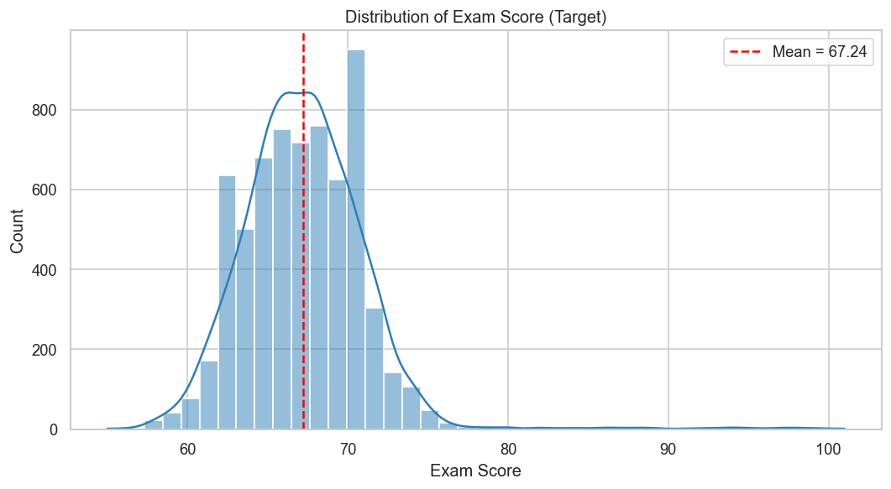
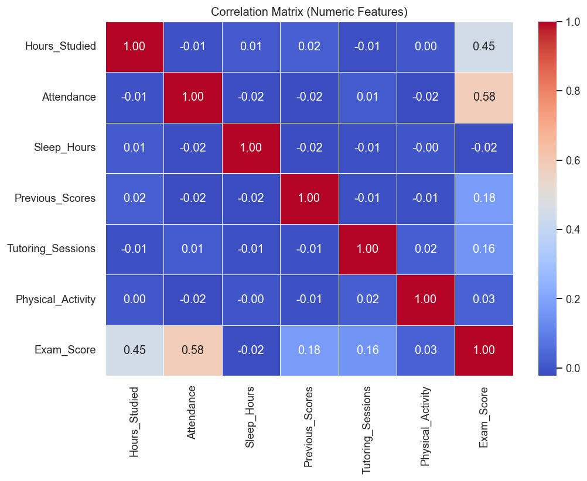
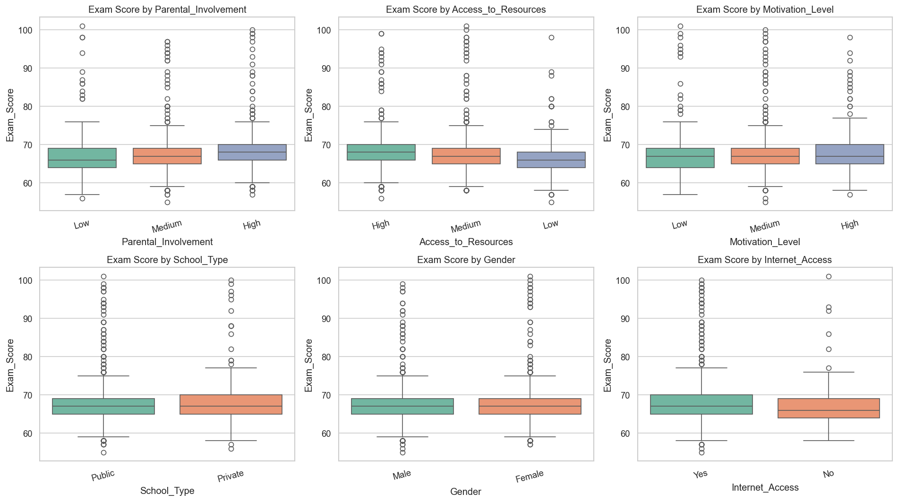
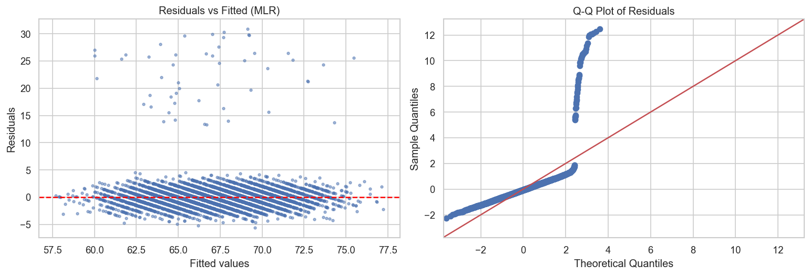
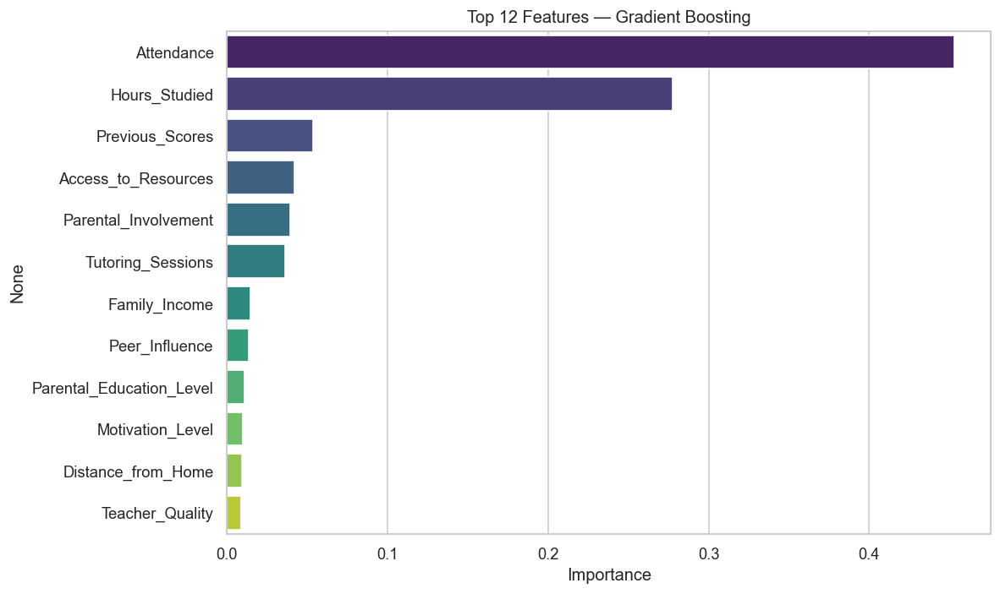
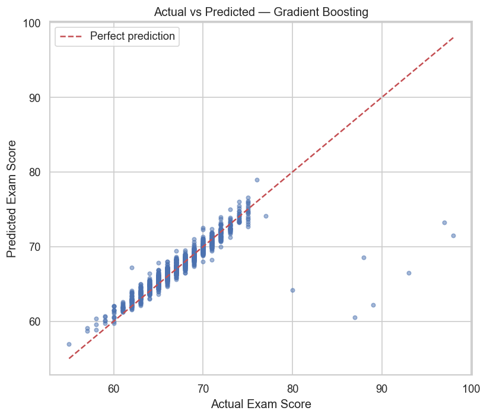

# Predicting Student Exam Performance — Statistical Inference & Machine Learning

An end-to-end applied statistics and machine learning project that analyses **6,607 students** to answer two
complementary questions:

1. **Inference (WHY):** Which factors *significantly* influence a student's exam score?
2. **Prediction (WHAT):** How accurately can we *predict* an exam score from these factors?

## Problem Statement

> Given 19 behavioural, environmental, and demographic attributes of 6,607 students, use statistical hypothesis
> testing and regression inference to identify which factors **significantly** influence `Exam_Score`, and train
> and compare four regression models to **predict** the score, producing an interpretable, cross-validated,
> reproducible pipeline.

## Highlights

- **Statistical hypothesis testing** — Welch's independent t-test, one-way ANOVA, Pearson correlation,
  and paired t-test (pre- vs post-intervention).
- **Regression-based inference** — simple & multiple OLS regression with full diagnostics (VIF, Breusch–Pagan,
  Shapiro–Wilk) and categorical (type II) ANOVA.
- **Machine learning pipeline** — Linear Regression, Ridge, Random Forest, and Gradient Boosting with
  5-fold cross-validation and a 20% holdout evaluation.
- **Best model:** Gradient Boosting — **R² ≈ 0.74**, **RMSE ≈ 1.90** on unseen test data.
- Fully reproducible single-notebook workflow with saved plots, metrics, and predictions in `results/`.

## Dataset

| File | Description |
|---|---|
| `data/StudentPerformanceFactors.csv` | Primary dataset — 6,607 students × 20 columns (19 features + target). |
| `data/CategoricalStudentData.csv` | Categorical-feature subset used for categorical ANOVA analysis. |
| `data/PairedTestDataset.csv` | 300 students measured before and after an intervention (paired t-test). |

The target variable is **`Exam_Score`** (continuous, range 55–101).

## Project Structure

```
.
├── Student_Performance_ML_Analysis.ipynb   # Main deliverable (all sections executed, 0 errors)
├── data/                                   # All datasets
├── results/                                # Generated artifacts (plots, metrics, predictions)
│   ├── exam_score_distribution.png
│   ├── correlation_heatmap.png
│   ├── categorical_boxplots.png
│   ├── mlr_diagnostics.png
│   ├── feature_importance.png
│   ├── pred_vs_actual.png
│   ├── model_comparison.csv
│   └── test_predictions.csv
├── archive/                                # Original draft notebooks (kept for reference)
├── requirements.txt                        # Python dependencies
└── .gitignore
```

## Notebook Workflow

| # | Section | Purpose |
|---|---------|---------|
| 1 | Imports & Setup | Load libraries, configure plotting |
| 2 | Data Loading | Read the student dataset |
| 3 | Data Cleaning | Handle missing values (median / mode imputation) |
| 4 | Exploratory Data Analysis | Distributions, correlations, group effects |
| 5 | Hypothesis Testing | t-test, ANOVA, correlation, paired t-test |
| 6 | Regression-based Inference | Simple & multiple OLS + diagnostics |
| 7 | Machine Learning Pipeline | Encode → split → CV → train → evaluate → interpret |
| 8 | Results & Conclusion | Final metrics, answers to hypotheses |

## Results

### Hypothesis testing summary (α = 0.05)

| Test | p-value | Verdict |
|---|---|---|
| Gender (Welch's t-test) | 0.87 | Not significant |
| Parental Involvement (ANOVA) | < 0.001 | Significant |
| Hours Studied (correlation) | < 0.001 | Significant |
| Pre vs Post test (paired t-test) | < 0.001 | Significant |
| Hours_Studied slope (OLS) | < 0.001 | Significant |

### Model performance (20% holdout test set)

| Model | R² | RMSE | MAE |
|---|---|---|---|
| **Gradient Boosting** | **0.7436** | **1.9038** | **0.7117** |
| Linear Regression | 0.6888 | 2.0974 | 1.0155 |
| Ridge Regression | 0.6888 | 2.0974 | 1.0155 |
| Random Forest | 0.6607 | 2.1901 | 1.1182 |

### Visual results

#### Distribution of the target variable



#### Correlation matrix (numeric features)



#### Categorical factors vs exam score



#### Multiple regression diagnostics



#### Feature importance (best model)



#### Actual vs predicted (best model)



## Getting Started

### Prerequisites

- Python 3.10+
- [Jupyter](https://jupyter.org/) (notebook interface)

### Installation

```bash
# 1. Clone the repository
git clone https://github.com/MoulendraBalaji/student-performance-ml-analysis.git
cd student-performance-ml-analysis

# 2. (Optional) Create and activate a virtual environment
python -m venv .venv
.venv\Scripts\activate          # Windows
source .venv/bin/activate       # Linux / macOS

# 3. Install dependencies
pip install -r requirements.txt
```

### Usage

Open the notebook and run all cells:

```bash
jupyter notebook Student_Performance_ML_Analysis.ipynb
```

Or execute it headlessly:

```bash
jupyter nbconvert --to notebook --execute --inplace Student_Performance_ML_Analysis.ipynb
```

All generated plots, the model-comparison table, and test-set predictions are written to `results/`.

## Key Findings

- **Attendance, Previous Scores, and Hours Studied** dominate both inference and prediction — study effort and
  attendance are the main drivers of academic performance in this dataset.
- All VIF values < 10 indicate no problematic multicollinearity in the multiple regression model.
- The Gradient Boosting model explains **≈74% of the variance** in exam scores, a strong result for noisy
  behavioural data.

## Author

**Moulendra Balaji** — [GitHub](https://github.com/MoulendraBalaji)

## License

This project is for educational purposes.
